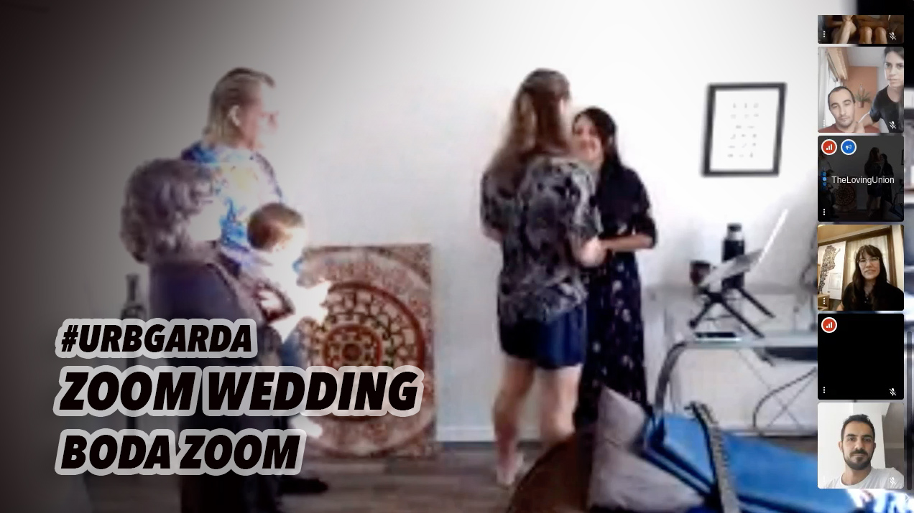
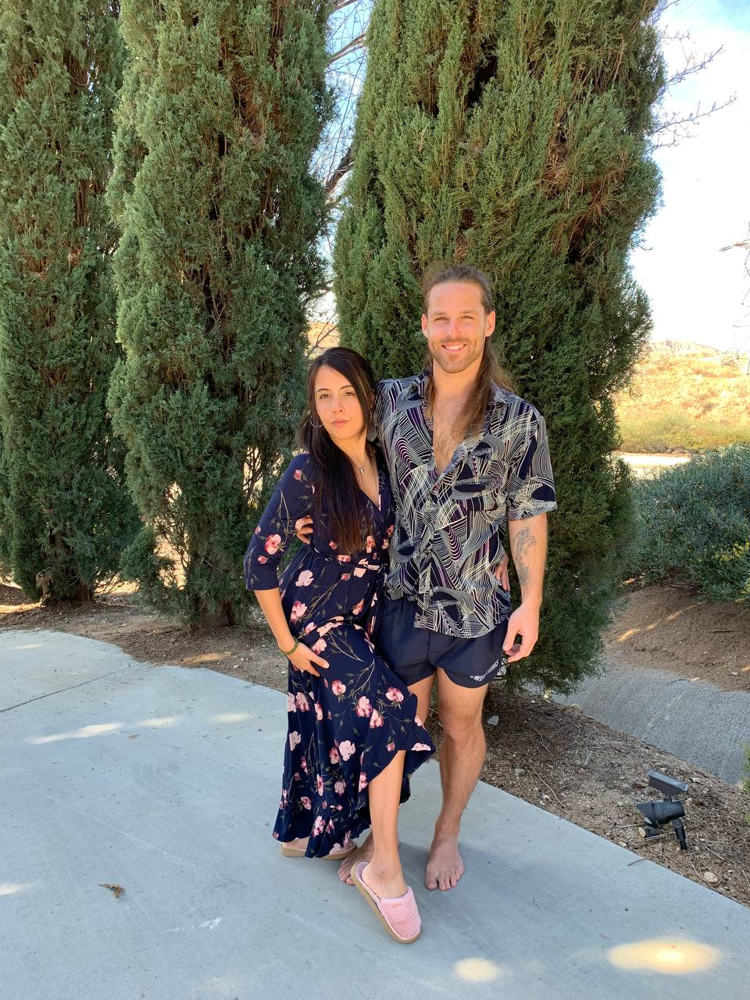
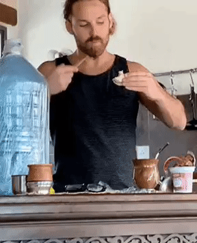
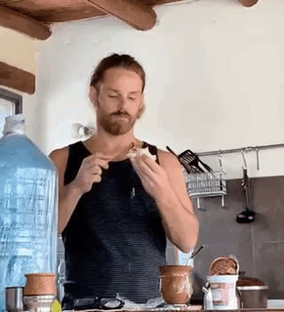
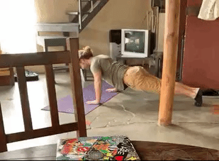

Greetings from the other side! Lau and I finally tied the knot with the state and we are officially legally wed. (It took 13 months from the time of our actual "wedding" celebration.) And it happened on Zoom. Weird times to be sure, but it's one more bureaucratic step forward that hints at the light at the other end of the tunnel that began a year ago. Here's the comical video (music by me):

2 videos in this one! This week's mail is a long one, spanning a variety of topics including my perspective on my partnership with Lau leading into her third trimester, my "sympathy" binge eating, a sweaty February in Argentine summer, and it nerds out a bit when I get into my laptop locking me out. There is also a video of our pregnancy photo shoot down below. The second part of Feburary 2020 will be the next email, focused on the week I spent in Chile as one "last hurrah" before my life changed forever.

## Cordoba, Argentina - Feb 2020

### Waiting for the fiance visa
So there we were, waiting for our embassy appointment as January came to a close. Amidst a sultry routine of passing time in the heat of summer, when businesses close and bureacratic operations appear to be on vacation, I began to accept that the likelihood of us getting Lau's Fiance Visa interview within a reasonable timeline for a pregnant woman to travel was slim to none.  The nail in the coffin came one day when she realized something important:

"You know, it's probably not a good idea to do the chest X-ray while pregnant."

"You have to do a chest X-ray for the visa?"

"*Si.* And the medical exam is an extra $200 we have to pay."

Money matters aside, it was an important point. We'd been doing our best to keep an energetically clean environment for her and the baby inside her—both by mainstream scientifically-approved methods (like diet and the right kinds of exercise) but also with techniques bordering on new age marketing woo woo (with such products as a pair of headphones with "radiation blockers" on the cords so the pregnant mother wouldn't absorb the electronic waves broadcasting from the source of the audio signal. They cost $25 and the audio quality was so poor I didn't think it could be worth it.)—and the *X-ray-during-third-trimester* topic happened to share an opinion on both sides of the spectrum. Not recommended.

So that was that. Ironically, the U.S. Embassy got ahold of us shortly after that decision was made.

### Partnership and Pregnancy (an excerpt)
I couldn't tell you another time I was as dedicated a partner and lover as I was during that third trimester. The entire pregnancy was an opportunity for me as a human being to learn to neutralize the naturally-selfish instinct triggered by my own desires, needs or fantasies and allow space for something more unconditional. Perhaps it's a built-in part of our biology that prepares us for becoming parents of new little creatures on this Earth (because sometimes it's truly a test of patience and unconditional love, as Aquiles Ananda has proven). 

What started as a very intense relationship in all the right, fun, and unstressful ways became very serious very fast when a baby began to grow inside her belly. A baby I gave her. And an urgency to learn the adult responsibility I'd never needed to know welled up inside of my own belly. I hadn't lacked on the personal development, self-observation front in the past handful of years comprised of travel, relationships, and psychedelics; however I had never quite figured out how to stay, how should we put it? *Materially sustainable*, both mentally and physically, while grounded in one location. I knew how to offer value in exchange for the well-being of my health, comfort, and community; but I had never been equipped to stay in one place, earn a steady living, and stay grateful for what life offered.

But I was becoming a father, and the sense of responsibility grew alongside her little belly. It was time to figure out how to survive like normal people did, who didn't just hop on a plane with a credit card and fly to the next friend or film project that would host them for a few weeks and maybe pay me a few bucks until it was time to move on.

It was time to figure out how to make money.

Fortunately, Lau excelled in that field. While I could focus my words on her ability to market her value and transform her work energy into income (I'll talk about our businesses in an upcoming mail), instead I'll share a word on the dedication she puts into everything she does: inspiring. 

"Work" for me could be one of two things, the worser of which is the stuff I just don't want to do but must be done. I'd much rather "work" in my creative space, creating whatever I want however I want to, feeling good in the process. I've spent time turning that into a career that had yet to pay off materially, but internally I'd not had to feel the imaginative ball-and-chain of a consistent job (and instead shackle myself with unnecessary expectations, but that's another story). P

Point being, the stuff that has always "made money" is the stuff I just couldn't bring myself to do because it wasn't worth giving up my time for money. I used to call that "values" and to an extent has helped me realize my worth as noted in my rates per hour; but meeting Lau had showed me that I can take pride in the shitty stuff too, and in turn appreciate the money that is "made" from it by spending it on continuing a lifestyle of abundance.

In other words, it's OK to take shitty jobs if you need to make some money.

Not only does she work with pride, but she lives with pride. Her "work" and that pride translate into how clean the house, in particular the kitchen, in particular the floor of the kitchen, will appear at any given moment. Her free moments are not spent clicking around a computer like mine would be; instead she is chopping cabbage for sauerkraut or freezing bananas for her homemade ice cream maker. There is literally never a slow moment for this Capricorn, and I envy/admire her ability to look past the lethargy when it hits and stay in activities that keep her vibe up.

Lau has always supported the projects to which I dedicate myself even though they have yet to turn some kind of profit (it's been quite the opposite, really). She has always understood that I work from my heart and can't have it any other way. Perhaps that's one of the reasons she loves me; as far as I am concerned, it's why our partnership has flowed so smoothly as day-to-day, life companions. I am not only permitted to be free to let my intuition reign, but I am supported in it.

It's funny when we realize how simple our requirements are. I'd spent so many years trying to escape monogamy while  imagining the perfect partnerships, resigning myself to a life of nomadic solitude and blaming anyone but myself for not manifesting the fantastical image of what cannot exist past my mind. The first few months leading into Lau magically becoming pregnant was a process of shedding all that over-complication and allowing a woman to simply love me.

She would be 8 months pregnant when fate decided to put our love, and my resolve, to the test.

### A loft on a busy street, a little routine.
In the intersection of city and suburb, a transitioning land of industrial and airport, outside the main freeway that circled Cordoba, we found a little loft above a boutique clothing shop on a busy street. I didn't know would be a busy street based off its Airbnb listing. (Of course, all the Argentines told me that it's not at all a busy street, but I'd find out soon enough that the luxury of silence in urban areas was something reserved for a small subset of people in this country.) We moved into the quaint little cottage-like apartment whose floorboards squeaked when we walked and at times the odor of sewage rose up through the kitchen sink. Aside from a master bedroom illuminated all night long by the streetlights from the boulevard, there were two single beds in the attached attic/mezzanine. The place reminded me of somewhere you go with your parents for a family reunion.

There was no TV and I slung my hammock up across the common space. We could practice yoga in the living area, cook in the sunny kitchen, and work at the kitchen table. The bed, like most "full"-sized beds in South America, was actually two single bed mattresses topped with a puffy cotton layer protector that had a fifty-fifty chance of sliding apart in the middle of the night, losing pillows and cuddle partners in the process. (That's an exaggeration, but they are certainly not my favorite type of bed. When we traveled through Peru a few months before, I had to stop and wonder if queen sized mattresses was even a thing on this continent.)

February was spent in a state of trying-to-find-routine in any way we could. The loft was only available until the end of the month which meant we still had to find a nice place to live for her final month of the pregnancy and at least a month after. Our days were normally started with computer work, walks, cooking, and yoga, then normally followed by a visit with one of Lau's friends or family, and then having an outing, either to check out a new potential home for the birthplace of our child, a trip downtown to the artisan's market, or just casually stroll to one of the several restaurants that comprised the nightlife on our busy street. 

### Routine and food.

It was hot but we were not without distractions from that particular discomfort. A gelato parlor was below us next door and, as someone who had transitioned in life from s*hit grocery store ice cream* to *health nut I don't eat ice cream* to *vegan so will eat non-dairy ice cream sweetened with agave*, I'd never really had proper time to go through a gelato phase despite all my time in Europe. 

Well let me tell you, the gelato really got me. In particular the *bon bon* *Suisse* which was a more of a delicacy than a gelato: a chocolate coated vanilla ice cream with a clump of *dulce de leche* milk caramel at the middle. Out of this world. 

Oh, and we would buy pastries from the gluten-free bakery two blocks down. And I started drinking gluten-free beer on the regular because the cheese and wine shop on the corner had a place to sit outside with the stuff you bought in the market. That also lead us to eating tableaus of cheese and salami because, well, this was Argentina. 

Lau had some fun making GIFs of me:

"I think you have the *sympathy pregnant eating*," Lau said to me once when she noticed my appetite for carnal vice was like nothing she had ever seen in me before. She was right, there was definitely something going on with that. I couldn't stop eating.

Meanwhile, I would get nauseous every time we hopped in a car and I wasn't driving, so I was grateful for the CBD serum I'd traveled with from California. Between the car rides and sugar headaches, I was going through it like water or breath mints. It was a good thing my mom would be bringing more when she came to visit for the baby's birth in a few weeks.

One night we heard a rat scratching around in the attic. The next night, we saw the rat in the ceiling panels which were also the attic floorboards. A couple nights later, we swore we saw two on different sides of the room. The owner of the loft said she'd never had a problem with rats before but maybe the construction site of the barn next door was causing some displacement of their normal homes. That same construction zone—its owner some fortuitous soul who must have inherited the plot  from one of his grandfathers who must have been bought it when it was practically being given away by the government to attract new citizens to its shores—this same construction zone was what brought my irritation levels up each weekday when its one single construction worker (no doubt the *inheritee* himself who is repairing the barn so he can sell it to convert into a chic resto-bar so he can move peacefully into the mountains) would begin his drill/welding iron/hacksaw every morning at nine until around one, and then again around five until sundown. Good God.

This was summer, so you'd be hard-pressed to find anyone working between one and five in the afternoon. This includes but is not limited to smaller shops and non-franchised markets. Oh, and even when it's not summer, restaurants close from 3pm til 8pm. I hadn't eaten after 8pm in years, because it affects my sleep. (Both of these eccentricities to me are the smirking cultural epigenetic hand-me-downs of the "f*ck you, we're Italian/Spanish" variety that still exist to this day in the Mediterranean. I stop to think about my Italian ancestors as small business owners in Chicago and wonder if they spent more time resting than they did actually working.)

### Pregnancy photoshoot

This one has a video, so I think I will let it do the speaking. Music by CloZee.

### Always back up your data, son.

Perhaps the most interesting moment of this short-lived era of the loft was losing access to my laptop. An avid privacy enthusiast due to my interest in things like decentralized software and cryptocurrencies, I was doing a routine resetting of all my main passwords one night (this was before I'd discovered encrypted database apps meant exclusively for password management, but that's another topic). I was a little Corona buzzed when I decided to change my computer's main login password just to be safe. This may have been a little paranoid, but I had been experimenting with a third-party cloud service and had uploaded exports of my browser's saved password lists on its servers, so I didn't think I could be too careful.

I restarted the computer, logged in and out a few more times before calling it a night. The next day, we went for an *asado* at Lau's family's house. I always brought my computer for that inevitable moment when the conversation was finished and I wasn't part of the family so I'd go upstairs and work. (What that really means is, it wasn't *my* family nor my first tongue, so it was difficult to sit around and shoot the shit). I sat down and continued work on the final touches of the current version of the [Perceptions.Live](http://perceptions.Live) user flow. 

My laptop makes me log back in after it is closed, or I am away from it for ten minutes. I'm telling you this because between the time I changed my password the night before and right about when I had to run downstairs for a glass of water but got caught watching a part of Spanish-dubbed *True Lies* on the television with *Tio Alfonso*—in that time, somehow something stopped reading itself properly inside my little machine and my new password would no longer grant me access. Not just that, but either my recovery key didn't work or I wrote it too sloppily to read it correctly (and I never, *never* use iCloud).

I spent a week as an OCD maniac on Excel trying to permutate every possible combination of my butchered recovery key in order to brute force my way back in. Nada. In order to fill in the proper formula for Excel to calculate all the potential variations of the missing key, I first had to research how to do that kind of thing. I had to use my non-admin, and hardly touched, *Writing* account to try to hack in to the encrypted hard drive without sudo privileges. I spent a week on this and got nowhere. My computer was fucked, my files lost for the foreseeable future. I learned a lot and felt satisfied doing that research, but I was still screwed.

It was time to move on. I chose to look at it like a time to take a break.

### I decide to go to revolution-torn Chile.

Mid-way into the month, my routine had maxed out in this loft. I'd lost my work momentum with the computer, it was hot, and I was caught in that slippery slope of eating too much junk food because I wasn't fulfilled elsewhere. And as I introduced in the previous installment, I wasn't a fan of this place at all. Especially, mind you, as a man who had always taken so much pride in his freedom. Both with location and women. My whole existence now centered around having this baby and making sure his mother would be as comfortable as possible in that experience, all while we lived here. I tried to separate that from my day-to-day emotional fluctuations (often reactions to the sugar) as best I could. Despite everything, I was glad Lau could be nearby her loved ones in familiar territory for this brand new thing that was about to happen. 

In fact, I was so glad that she was comfortable that I felt like I could open up to some of my own cowering vulnerability and bring something important up. Before this era of my life ended forever, I wanted to take a trip. 

Chile would be my 50th country/passport stamp. I figured that was a nice, round number to top off a long era of life on the road. I would at long last be done with the backpacks, the back problems. The fleeting existence, the flings, the throwing myself into the wind because I had no ground to walk on. (See, I was still the *victim* of life; so much that I couldn't use my own feet.) In short, it was a good reason to have "one last hurrah" while Lau was comfortable and we were not yet with a freedom-restricting commitment that would last eighteen years.

Another good excuse was Alonso. A dear friend and also one of my many college roommates, the Chilean and I became great friends when he lived on our couch (paying rent to do so) for the second semester of my final year of university. He had been living in Paris for years, came to Long Beach for theater, was ten years older than me, and enjoyed speaking three languages casually with me. We would bike all around town getting shit-faced, going from party to party, bar to bar. He didn't have the budget to celebrate the way we decadent North Americans did, so I always took him under my wing when it came to that sort of celebration of life. I somehow had landed a three-day per week "work at home" job based out of Hollywood that paid me more than well enough to live the lifestyle I chose to live, of house parties and ganja smoke, dive bars and bike paths. (Of course, saving money and looking towards the future had not yet entered my consciousness—and nor would it until Lau became pregnant ten years later.)

Alonso, his wife and four year old child would be visiting Santiago in the very week that I was looking to visit, which was the final days of my thirty-first year. I'd return to Cordoba on my birthday. For the week I'd be there, Alonso invited me to stay in his friend's apartment with him and his family. 

What happened in Chile could not be made up, but requires context. I left with three goals in mind: meet people, have no plan, and write. The first one is normally easy when you stay at a hostel, but I was on a serious budget. Having no plan, for me, ends up being more destructive than imagined for me but I learned years ago that it is a therapeutic/medicinal act when imbibed upon only once in a while. 

And writing! I wanted to take it back to my early days of living this life. Sit at cafes or resto-pubs and write on a caffeine high or beer buzz. Those days used to be filled with science fiction and fantasy, coffee and whisky; this week they would be filled with reflection and the pondering of life, with yerba mate and maybe some beer. 

Little did I realize how eerily accurate my "last hurrah" would actually transpire.